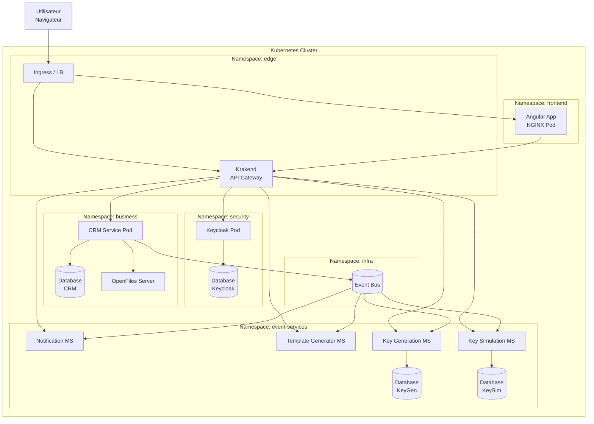

```mermaid
graph TB
    %% ===== External =====
    User[Utilisateur<br/>Navigateur]

    %% ===== Kubernetes Cluster =====
    subgraph K8S["Kubernetes Cluster"]

        %% Ingress / Edge
        subgraph EdgeNS["Namespace: edge"]
            Ingress[Ingress / LB]
            Krakend[Krakend<br/>API Gateway]
        end

        %% Frontend
        subgraph FrontendNS["Namespace: frontend"]
            Angular[Angular App<br/>NGINX Pod]
        end

        %% Security
        subgraph SecurityNS["Namespace: security"]
            Keycloak[Keycloak Pod]
            KCDB[(Database<br/>Keycloak)]
        end

        %% Business
        subgraph BusinessNS["Namespace: business"]
            CRM[CRM Service Pod]
            CRMDB[(Database<br/>CRM)]
            OpenFiles[OpenFiles Server]
        end

        %% Event-driven
        subgraph EventNS["Namespace: event-services"]
            Notification[Notification MS]
            TemplateGen[Template Generator MS]
            KeyGen[Key Generation MS]
            KeySim[Key Simulation MS]
            KeyGenDB[(Database<br/>KeyGen)]
            KeySimDB[(Database<br/>KeySim)]
        end

        %% Event Backbone
        subgraph InfraNS["Namespace: infra"]
            EventBus[(Event Bus)]
        end
    end

    %% ===== Connections =====
    User --> Ingress

    Ingress --> Angular
    Ingress --> Krakend

    Angular --> Krakend

    Krakend --> Keycloak
    Krakend --> CRM
    Krakend --> Notification
    Krakend --> TemplateGen
    Krakend --> KeyGen
    Krakend --> KeySim

    Keycloak --> KCDB

    CRM --> CRMDB
    CRM --> OpenFiles
    CRM --> EventBus

    KeyGen --> KeyGenDB
    KeySim --> KeySimDB

    EventBus --> Notification
    EventBus --> TemplateGen
    EventBus --> KeyGen
    EventBus --> KeySim

```